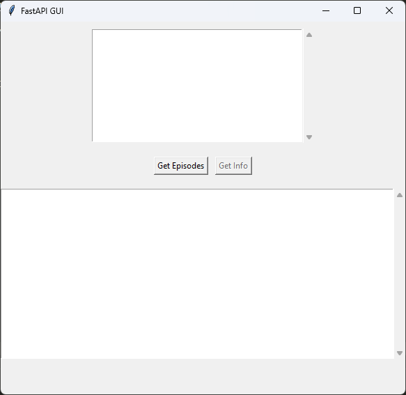
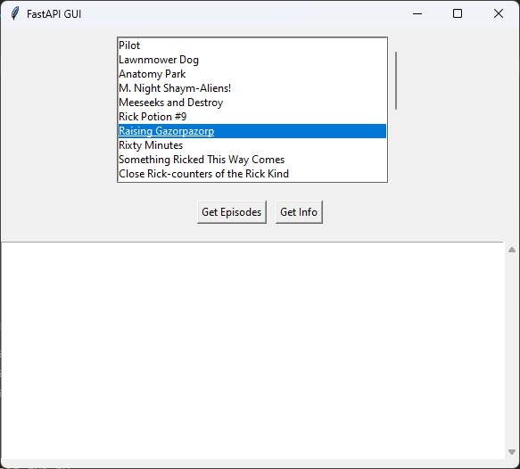
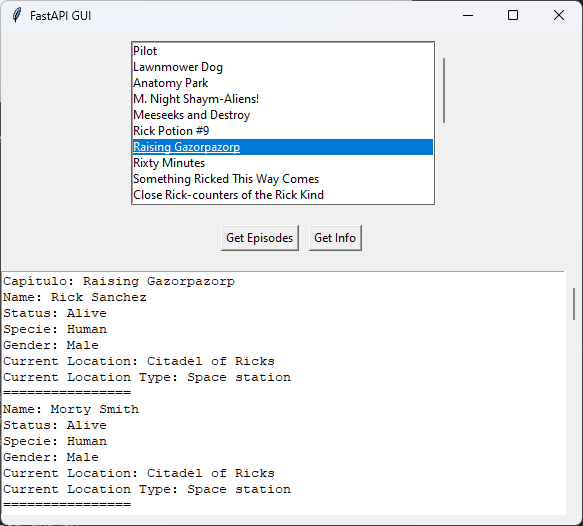
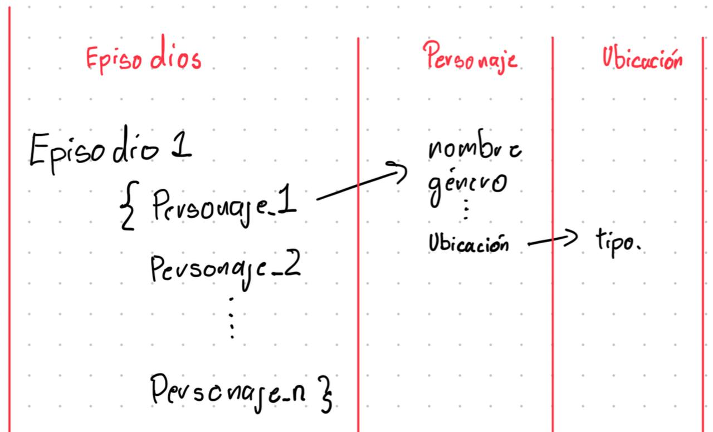

# Prueba técnica Bios analísta de robótica
### Autor: Jairo Andrés Cortés Roncancio

### Contacto: jcortesro99@gmail.com

## Bibliotecas y dependencias usadas

Para el desarrollo de esta prueba se usó fastapi para consumir las APIs y para la interfaz gráfica se usó tkinter.

### Instalación:

Para poder usar la solución se requiere instalar los archivos de requitements.txt, en la istalación no se encuentra tkinter ya que viene por defecto con python en windows, en caso de usar linux si toca instalarlo.
        
        pip install requirements.txt

### Logica de desarrollo.

Teniendo en cuenta el enunciado y un vistazo rápido a el enpoint "https://rickandmortyapi.com/api/episode", se decidió usar FastAPI por su facilidad y eficiencia.

La patrón de diseño por capas (app, test, domain, gui) es muy complejo para este proyecto por lo que se optó por dejar todo en dos archivos. 

    main.py: archivo donde se aloja el código de FastAPI para consumir las APIs.

    main_gui.py: archivo donde se aloja el código que recibe la información del back (FastAPI) y muestra la interfaz gráfica.

Por el tiempo no se usó base de datos ni routes para los diferentes endpoints.

## Flujo del programa.

Se ejecuta el archivo:

                trusMeThisIsNotAVirus.bat

Al hacer esto estamos listos para seguir el Flujo planteado:

El primer paso es revisar qué cápitulos hay disponibles, para lo cual se hace click en el botón "Get Episodes". Esto ejecutara la consulta en el Back y devolverá la lista de cápitulos disponibles.

Se seleciona el cápitulo y se da click en el botón "Get Info" para extraer la información solicitada de los personajes en ese capítulo.

Se debe esperar un poco mientras se hacen las respectivas consultas.

La información comienza con el nombre del cápitulo y después cada personaje separado por "================================"

## Código

La documentación relacionada a las funciones se encuentra en el código. Sin embargo, acá se explica el flujo del mismo y como se pensaron las funciones.

### Back-end

A la hora de desarrollar la prueba no se tuvo en cuenta el hecho que existen los endpoints de las listas compeltas de personajes y ubicaciones. 

La solución se planteó a partir de sacar toda la información a partir del endoint de los episodios.

Como el usuario comienza consultando todos los episodios, se consume este endpoint para obtener la información de todos los episodios y poder entregarle una lista al usuario.

A partir de esta lista el usuario puede obtener todos los personajes de cada cápitulo, lo que se planteó fue recorrer todos los personajes de cada capítulo e ir extrayendo su información.

Dentro de cada personaje se encuentra el link de la ubicación para poder sacar el tipo de ubicación. De esta forma, a partir de episodios se va tambien a cada personaje y a su vez se va a la ubicación actual de ese personaje. 

Una vez terminado con todos los personajes se manda la información al front (aplicación) con la información solicitada en el enunciado.

Al momento de hacer las pruebas se evidencia que el código tiene que hacer muchas consultas a las APIs por lo que es muy lento, para mitirgar esto lo primero que se hizo fue guardar en un diccionario la información de las ubicaciones. En caso de ya haber buscado una ubicación, esta se guarda y cuando se vuelva a buscar se extrae la información del diccionario y se evita hacer una consulta a la API de la ubicación.

A pesar de esto muchas veces se repiten personajes en varios episodios, por ende se creó un diccionario para guardar las url como llaves y como valor asignado la información requerida de cada personaje. Esto permite que una vez cargado un personaje no se tiene que ir a su endpoint, ni al de su ubicación.

### Front-end

Para el desarrollo del frontend en este proyecto, utilicé Tkinter debido a mi fortaleza principal es el backend. Aunque el diseño y desarrollo de interfaces gráficas no es mi fortaleza, empleé ChatGPT para generar la estructura y lógica de la interfaz, permitiendo una integración efectiva con el backend. He manejado el frontend en este proyecto con herramientas básicas y conceptos previos de frameworks como Angular y React. Estoy comprometido a aprender y mejorar en áreas adicionales según sea necesario.

### Conclusiones y comentarios.

Esta solución no es la más optima, lo más optimo es que apenas se ejecute el Back, este descargue los 3 endpoints principales (episodios, personajes y ubicaciones) y a partir de acá solo es manejo de texto, listas y diccionarios, es decir, que guarde los json como diccionarios y se van consultando, de esta forma solo se hacen 3 peticiones a las APIs. Pero como no caí en cuenta al inicio, hice esta solución que va guardando la información a la vez que la buscando y recorriendo los diferentes endpoints. Esta forma es más cercana a realidad donde muchas veces tenemos cantidades gigantescas de información y descargar todo no es una opción. Además, permitió mostrar mis nociones sobre funciones asincronas, "sobre carga de métodos" y recursividad.

Por falta de tiempo y por el propio proyecto tampoco se implementarion rutas, base de datos, middelwares, ect. 

Mi fuerte no es el Front ni el diseño de interfaces, razón por la cual no me extendí explicandola. Sin embargo, soy capaz de modificar y adaptar ese código según las necesidades y afortunadamente contamos con las herramientas de Inteligencia Artificial para agilizar el trabajo de desarrollo.

Durante el proceso de prueba de los enpoints usé la aplicación Postman para probralos. También encontré algunos retos ya que muchos personajes no contaban con url de ubicación lo que me generaba un error en el código, para solucionarlo tuve que debuggear y manejar este error duplicando la condición de desconocido en tipo de ubicación.